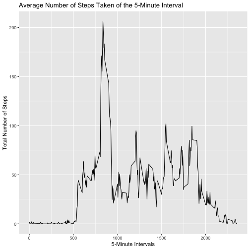

# Reproducible Research week2 project

## Load and process the data
 1. Load the data 
 2. Process/transform the data (if necessary) into a format suitable for analysis

```r
activityData <- read.csv('activity.csv')
summary(activityData)
```

```
##      steps                date          interval     
##  Min.   :  0.00   2012-10-01:  288   Min.   :   0.0  
##  1st Qu.:  0.00   2012-10-02:  288   1st Qu.: 588.8  
##  Median :  0.00   2012-10-03:  288   Median :1177.5  
##  Mean   : 37.38   2012-10-04:  288   Mean   :1177.5  
##  3rd Qu.: 12.00   2012-10-05:  288   3rd Qu.:1766.2  
##  Max.   :806.00   2012-10-06:  288   Max.   :2355.0  
##  NA's   :2304     (Other)   :15840
```

```r
head(activityData)
```

```
##   steps       date interval
## 1    NA 2012-10-01        0
## 2    NA 2012-10-01        5
## 3    NA 2012-10-01       10
## 4    NA 2012-10-01       15
## 5    NA 2012-10-01       20
## 6    NA 2012-10-01       25
```

## What is mean total number of steps taken per day?
 1. Calculate the total number of steps taken per day

```r
stepsByDay <- tapply(activityData$steps, activityData$date, sum, na.rm=TRUE)
head(stepsByDay)
```

```
## 2012-10-01 2012-10-02 2012-10-03 2012-10-04 2012-10-05 2012-10-06 
##          0        126      11352      12116      13294      15420
```
 2. Make a histogram of the total number of steps taken each day

```r
library(ggplot2)
qplot(stepsByDay, xlab='Total steps per day', ylab='Frequency', binwidth=500)
```


 3. Calculate and report the mean and median of the total number of steps taken per day

```r
stepsByDayMean <- mean(stepsByDay)
stepsByDayMedian <- median(stepsByDay)
```
* Mean: 9354.2295082
* Median:  10395

## What is the average daily activity pattern?
 1. Make a time series plot (i.e.type="l") of the 5-minute interval (x-axis) and the average number of steps taken, averaged across all days (y-axis)

```r
five_min_steps <- aggregate(steps ~ interval, data = activityData, FUN =mean)
ggplot(data = five_min_steps, aes(x = interval, y = steps)) + 
    geom_line() +
    xlab("5-Minute Intervals") + 
    ylab("Total Number of Steps") +
    ggtitle("Average Number of Steps Taken of the 5-Minute Interval")
```



 2. Which 5-minute interval, on average across all the days in the dataset, contains the maximum number of steps?

```r
five_min_steps[which(five_min_steps$steps == max(five_min_steps$steps)),]
```

```
##     interval    steps
## 104      835 206.1698
```

## Imputing missing values
 1. Calculate and report the total number of missing values in the dataset (i.e. the total number of rows with NAs)

```r
sum(is.na(activityData$steps))
```

```
## [1] 2304
```
 2. Devise a strategy for filling in all of the missing values in the dataset -- using mean for that 5-minute interval
 3. Create a new dataset that is equal to the original dataset but with the missing data filled in.

```r
library(dplyr)
replace_with_mean <- function(num) replace(num, is.na(num), mean(num, na.rm = TRUE))
activityDataImputed <- (activityData %>% group_by(interval) %>% mutate(steps = replace_with_mean(steps)))
head(activityDataImputed)
```

```
## # A tibble: 6 x 3
## # Groups:   interval [6]
##    steps date       interval
##    <dbl> <fct>         <int>
## 1 1.72   2012-10-01        0
## 2 0.340  2012-10-01        5
## 3 0.132  2012-10-01       10
## 4 0.151  2012-10-01       15
## 5 0.0755 2012-10-01       20
## 6 2.09   2012-10-01       25
```
 4. Make a histogram of the total number of steps taken each day and Calculate and report the mean and median total number of steps taken per day. 

```r
totalStepsImputed <- tapply(activityDataImputed$steps, activityDataImputed$date, sum)
qplot(totalStepsImputed, xlab='Total steps per day', ylab='Frequency', binwidth=500)
```


```r
meanStepsImputed <- mean(totalStepsImputed)
medianStepsImputed <- median(totalStepsImputed)
```
* Mean: 1.0766189 &times; 10<sup>4</sup>
* Median:  1.0766189 &times; 10<sup>4</sup>

Comparing with the values we got from the first part, the highest frequency is larger than the one we had with NAs. The means of each dataset are same. The medians of each dataset are slightly different.

## Are there differences in activity patterns between weekdays and weekends?
 1. Create a new factor variable in the dataset with two levels ??? ???weekday??? and ???weekend??? indicating whether a given date is a weekday or weekend day.

```r
activityDataImputed$WeekendOrWeekday <- ifelse(weekdays(as.Date(activityDataImputed$date)) %in% c("Monday", "Tuesday", "Wednesday", "Thursday", "Friday"), "Weekday", "Weekend")
head(activityDataImputed)
```

```
## # A tibble: 6 x 4
## # Groups:   interval [6]
##    steps date       interval WeekendOrWeekday
##    <dbl> <fct>         <int> <chr>           
## 1 1.72   2012-10-01        0 Weekday         
## 2 0.340  2012-10-01        5 Weekday         
## 3 0.132  2012-10-01       10 Weekday         
## 4 0.151  2012-10-01       15 Weekday         
## 5 0.0755 2012-10-01       20 Weekday         
## 6 2.09   2012-10-01       25 Weekday
```
 2. Make a panel plot containing a time series plot (i.e. type="l") of the 5-minute interval (x-axis) and the average number of steps taken, averaged across all weekday days or weekend days (y-axis). 

```r
averagedActivityDataImputed <- aggregate(steps ~ interval + WeekendOrWeekday, data=activityDataImputed, mean)
ggplot(averagedActivityDataImputed, aes(interval, steps)) + 
    geom_line() + 
    facet_grid(WeekendOrWeekday ~ .) +
    xlab("5-minute interval") + 
    ylab("avarage number of steps")
```


